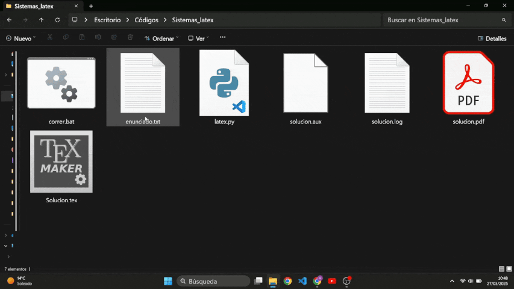

# Resolución de Sistemas Parametrizados con Sympy



Este repositorio contiene un script en Python que resuelve de forma simbólica un sistema de 3 ecuaciones lineales en función de un parámetro (designado como *a*). El programa utiliza la biblioteca [Sympy](https://www.sympy.org/) para llevar a cabo los cálculos simbólicos, determinantes, resolución mediante la regla de Cramer, análisis del rango de matrices (aplicando el teorema de Rouché-Frobenius) y eliminación gaussiana.

El script genera un documento LaTeX que documenta paso a paso la solución del sistema, mostrando desde la formación de la matriz aumentada hasta la obtención de las soluciones particulares y paramétricas.

---

## Características

- **Entrada dinámica:**  
  Lee desde el archivo `enunciado.txt` las líneas correspondientes a la matriz de coeficientes y los términos independientes.
  
- **Análisis simbólico:**  
  - Calcula el determinante de la matriz de coeficientes para determinar condiciones de compatibilidad.
  - Resuelve la ecuación $\det(A)=0$ para identificar valores críticos del parámetro *a*.
  - Aplica la regla de Cramer para obtener la solución cuando el sistema es compatible y determinado.
  - Realiza el análisis de rangos tanto de la matriz de coeficientes como de la matriz aumentada, explicando los casos de compatibilidad e incompatibilidad mediante el teorema de Rouché-Frobenius.
  
- **Eliminación Gaussiana:**  
  Emplea el método de eliminación por filas (sin pivoteo parcial) para obtener una solución escalonada y, a partir de ella, la solución del sistema.
  
- **Salida en LaTeX:**  
  Genera un archivo `Solucion.tex` con la solución detallada, incluyendo pasos intermedios, fórmulas y justificaciones teóricas en formato LaTeX para una presentación profesional.
  
- **Demostración visual:**  
  Se incluye un GIF en este README que muestra una demostración de la ejecución del script y la generación del documento LaTeX.

---

## Requisitos

- **Python 3.6 o superior**
- **Bibliotecas Python:**  
  - [Sympy](https://www.sympy.org/)
- **Distribución de LaTeX:**  
  Se requiere una instalación de *pdflatex* para compilar el documento generado. Se recomienda:
  - **TeX Live** (Linux/macOS) o
  - **MiKTeX** (Windows)

---

## Instalación

1. **Clonar el repositorio:**

   ```bash
   git clone https://github.com/MateoBAS/Latex_systems.git
   cd Latex_systems
2. **Crear un entorno virtual (opcional, pero recomendado):**
   ```bash
   python -m venv venv
   source venv/bin/activate   # En Linux/macOS
   venv\Scripts\activate      # En Windows
3. **Instalar las dependencias de Python:**
   ```bash
   pip install sympy
4. **Instalar una distribución de LaTeX:**
   Si aún no tiene pdflatex, instale una distribución de LaTeX. Por ejemplo, en Ubuntu puede instalar TeX Live con:
   ```bash
    sudo apt-get install texlive-latex-base
  En Windows, puede descargar MiKTeX y en macOS MacTeX.

---

## Uso

1. **Preparar el archivo de entrada:**
   El script requiere un archivo llamado enunciado.txt en el que se especifiquen, en líneas específicas, los elementos de la matriz y los términos independientes. Asegúrese de que el formato del archivo se ajuste a lo esperado (las líneas 5, 6 y 7 para la matriz y la línea 11 para los términos independientes), introduciendo los productos con el símbolo * y las potencias como ** (2a ≡ 2*a, $a^2$ ≡ a**2).
2. **Ejecutar el script:**
   Ejecuta `correr.bat`.

---

## Licencia

Este proyecto se distribuye bajo la [Licencia MIT](LICENSE).


